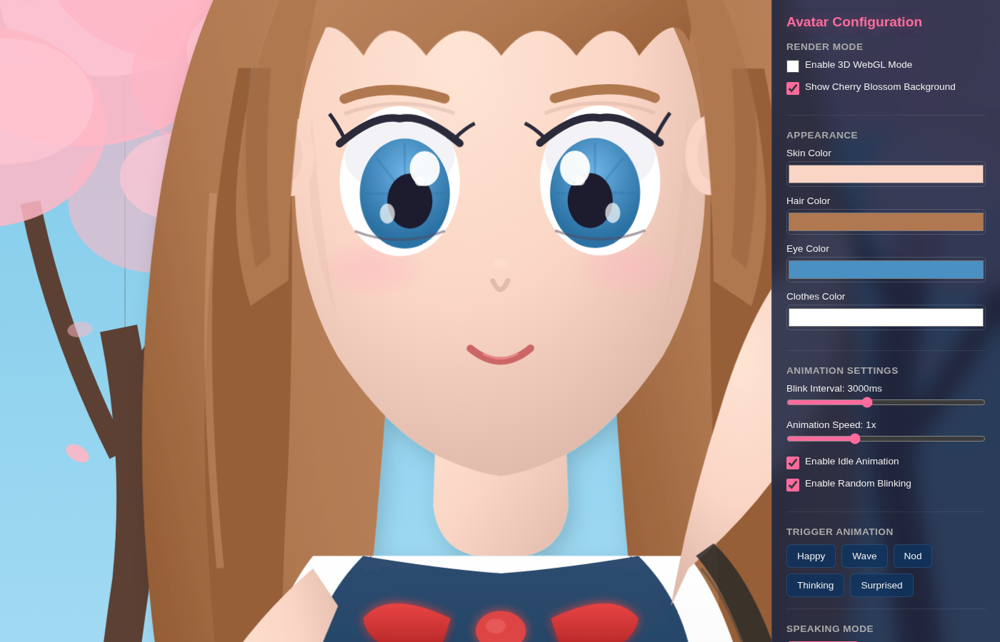
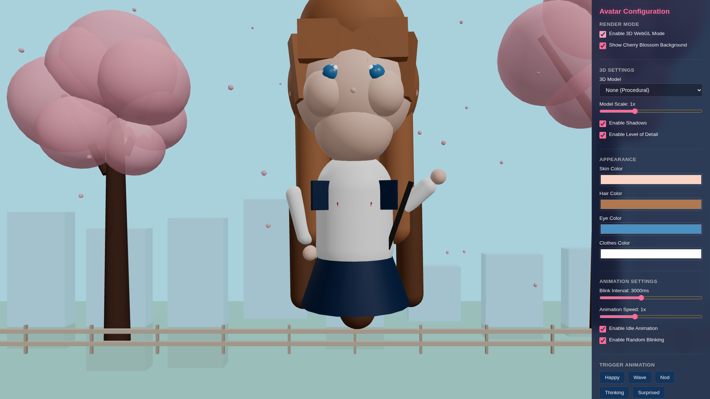
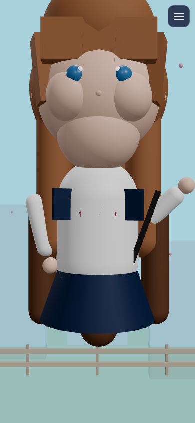
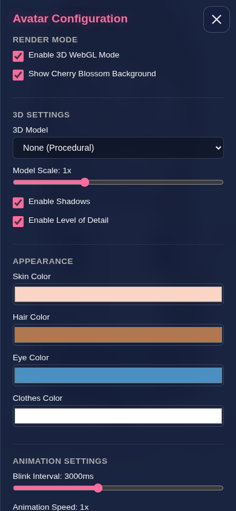
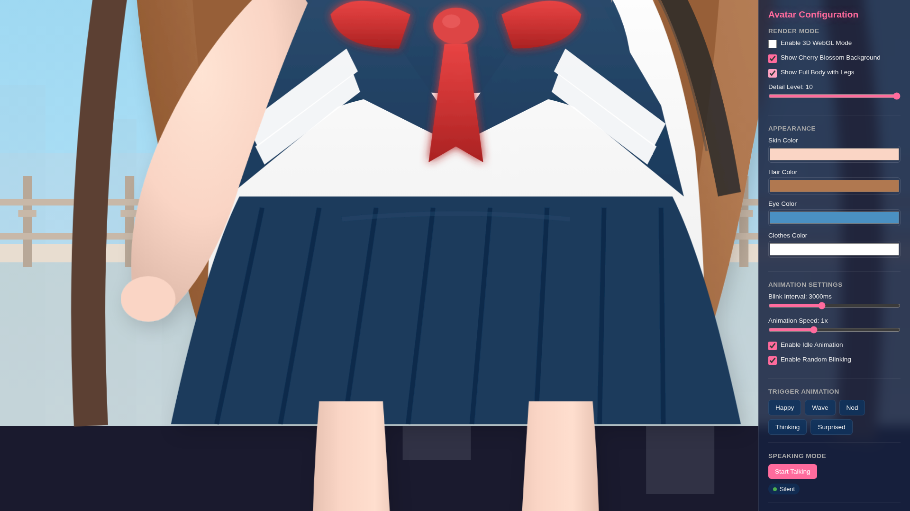
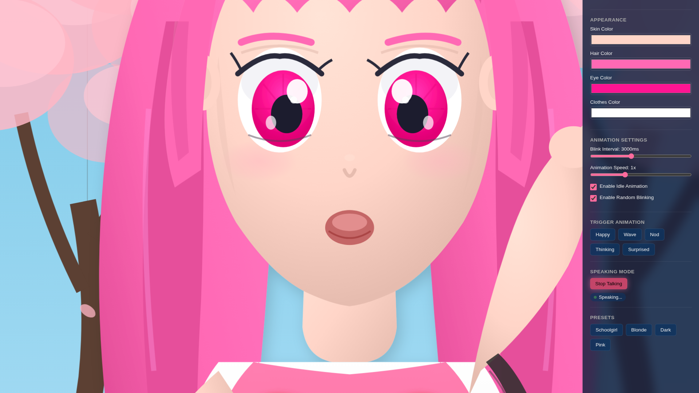

# Anime Avatar

A configurable AI anime avatar React component with animations, designed for use as an AI speaking avatar in web applications.

**[Live Demo](https://konard.github.io/anime-avatar)**

## Screenshots

### 2D SVG Avatar - Fullscreen Immersive View



_Detailed anime-style avatar with cherry blossom background, featuring anime eyes with reflections, detailed hair with highlights, and sailor uniform_

### 3D WebGL Avatar - Fullscreen Immersive View



_3D procedural avatar with animated falling cherry blossom petals and detailed background scene_

### Mobile View - Responsive Design

| Collapsed Menu                              | Open Menu                                             |
| ------------------------------------------- | ----------------------------------------------------- |
|  |  |

_Mobile-first design with hamburger menu and glassmorphism semi-transparent settings panel_

### Preset Customization (Pink Theme)


_Color presets allow quick customization - shown here with pink hair and eyes_

### Full Body Mode with Legs



_Full body view showing the sailor uniform skirt, legs with socks, and shoes (Genshin Impact style)_

### Talking Animation



_Talking mode with animated mouth for AI speaking scenarios_

## Overview

This project provides a customizable anime-style avatar component built with React. The avatar supports both **2D SVG rendering** (scalable to any screen size) and **3D WebGL/Three.js rendering** with synchronized styles. It features natural animations like blinking, head movement, and various expressions, making it ideal for AI-powered applications where a visual character representation is needed for voice interaction or chat interfaces.

The avatar includes:

- **Fullscreen Immersive Design**: Avatar fills the entire screen for maximum impact
- **Mobile-First Responsive UI**: Hamburger menu with glassmorphism semi-transparent settings panel
- **2D SVG Mode**: Highly detailed scalable vector graphics with anime-style eyes, detailed hair with highlights/shadows, and sailor uniform
- **3D WebGL Mode**: Three.js-powered 3D avatar with procedural geometry and animated falling petals
- **Cherry Blossom Background**: Beautiful animated background scene with trees, falling petals, fence/bridge, and cityscape silhouette
- **Color Customization**: Real-time color changes with preset themes

Future planned features:

- Voice input (Speech-to-Text) and output (Text-to-Speech)
- Local AI model integration for in-browser AI responses
- Export compatibility with Unreal Engine and Blender

## Features

### Visual Design

- **Highly Detailed 2D Avatar**: Anime-style SVG with detailed eyes (iris patterns, multiple highlights, reflections), hair with highlights and shadows, and authentic sailor uniform
- **Full Body Mode**: Optional full body view with legs, socks, and shoes (Genshin Impact style)
- **Configurable Detail Levels**: Adjustable detail from 1 (minimal) to 10 (maximum) controlling shape budgets for performance optimization
- **Modular SVG Architecture**: Separate React components for each body part (face, eyes, hair, body, legs, background) allowing independent testing and customization
- **Procedural 3D Avatar**: Three.js avatar with detailed anime head, hair, eyes with blush, and sailor uniform body
- **Cherry Blossom Background**: Full scene with cherry trees, animated falling petals, wooden fence/bridge, and cityscape silhouette
- **Dual Render Modes**: Switch between 2D SVG and 3D WebGL rendering

### User Interface

- **Fullscreen Immersive Experience**: Avatar fills the entire viewport for maximum visual impact
- **Glassmorphism Settings Panel**: Semi-transparent settings panel with backdrop blur effect
- **Mobile-First Design**: Hamburger menu that slides in from the right on mobile devices
- **Responsive Layout**: Adapts seamlessly from mobile to desktop

### Animations & Interactivity

- **Multiple Animations**: Idle, happy, wave, nod, thinking, surprised expressions
- **Random Animation Cycling**: Animations play randomly at configurable intervals for natural behavior
- **Talking Mode**: Lip-sync animation for AI speaking scenarios
- **Natural Blinking**: Random blinking with configurable timing for realistic appearance
- **Animated Falling Petals**: Cherry blossom petals fall continuously in both 2D and 3D modes

### Customization

- **Configurable Appearance**: Customize skin, hair, eye, and clothes colors in real-time
- **Preset Themes**: Quick appearance changes with built-in color presets (Schoolgirl, Blonde, Dark, Pink)
- **3D Model Support**: Load external GLTF/GLB models with automatic color customization

### Developer Experience

- **Separate Test Pages**: Dedicated pages for testing 2D and 3D modes independently
- **Reusable Component**: Easy to integrate into any React application

## Quick Start

### Prerequisites

- Node.js 20.0.0 or higher
- npm (comes with Node.js)

### Installation

```bash
# Clone the repository
git clone https://github.com/konard/anime-avatar.git
cd anime-avatar

# Install dependencies
npm install
```

### Development

```bash
npm run dev
```

Open [http://localhost:5173](http://localhost:5173) in your browser to see the demo application.

### Build for Production

```bash
npm run build
```

### Preview Production Build

```bash
npm run preview
```

## Usage

### Basic Usage (2D SVG)

```jsx
import AvatarSVG from './components/AvatarSVG';

function App() {
  return <AvatarSVG />;
}
```

### Basic Usage (3D WebGL)

```jsx
import Avatar3D from './components/Avatar3D';

function App() {
  return <Avatar3D />;
}
```

### With Full Configuration

```jsx
import AvatarSVG from './components/AvatarSVG';
import Avatar3D from './components/Avatar3D';

function App() {
  const config = {
    skinColor: '#fad5c5',
    hairColor: '#b07850',
    eyeColor: '#4a90c2',
    clothesColor: '#ffffff',
    clothesSecondaryColor: '#1a3a5c',
    blinkInterval: 3000,
    animationSpeed: 1,
    enableIdleAnimation: true,
    enableRandomBlink: true,
    showBackground: true,
    // 3D-specific options
    enable3D: true,
    enableShadows: true,
    enableLOD: true,
    modelScale: 1,
  };

  // Use AvatarSVG for 2D or Avatar3D for 3D
  return config.enable3D ? (
    <Avatar3D config={config} isTalking={false} currentAnimation="idle" />
  ) : (
    <AvatarSVG config={config} isTalking={false} currentAnimation="idle" />
  );
}
```

### With Animation Cycling Hook

The `useAnimationCycle` hook provides automatic random animation cycling:

```jsx
import AvatarSVG from './components/AvatarSVG';
import { useAnimationCycle } from './hooks/useAnimationCycle';

function App() {
  const { currentAnimation, triggerAnimation } = useAnimationCycle({
    enabled: true,
    minInterval: 8000,
    maxInterval: 20000,
    animationDuration: 1500,
  });

  return (
    <div>
      <AvatarSVG currentAnimation={currentAnimation} />
      <button onClick={() => triggerAnimation('wave')}>Wave</button>
      <button onClick={() => triggerAnimation('happy')}>Happy</button>
    </div>
  );
}
```

### With Talking Mode (for AI Voice Applications)

```jsx
import { useState } from 'react';
import AvatarSVG from './components/AvatarSVG';

function AISpeakingAvatar() {
  const [isTalking, setIsTalking] = useState(false);

  // Toggle talking when AI starts/stops speaking
  const handleAIResponse = (speaking) => {
    setIsTalking(speaking);
  };

  return <AvatarSVG isTalking={isTalking} />;
}
```

## Configuration Options

### Avatar Configuration

| Option                  | Type    | Default   | Description                                     |
| ----------------------- | ------- | --------- | ----------------------------------------------- |
| `skinColor`             | string  | `#fad5c5` | Skin color (hex format)                         |
| `hairColor`             | string  | `#b07850` | Hair color (hex format)                         |
| `eyeColor`              | string  | `#4a90c2` | Eye/iris color (hex format)                     |
| `clothesColor`          | string  | `#ffffff` | Clothes/outfit color (hex format)               |
| `clothesSecondaryColor` | string  | `#1a3a5c` | Secondary clothes color (collar, etc.)          |
| `blinkInterval`         | number  | `3000`    | Average time between blinks (ms)                |
| `animationSpeed`        | number  | `1`       | Animation speed multiplier (0.5x - 2x)          |
| `enableIdleAnimation`   | boolean | `true`    | Enable subtle idle breathing/sway               |
| `enableRandomBlink`     | boolean | `true`    | Enable random natural blinking                  |
| `showBackground`        | boolean | `true`    | Show cherry blossom background                  |
| `detailLevel`           | number  | `10`      | Detail level 1-10 (controls shapes rendered)    |
| `showLegs`              | boolean | `false`   | Show full body with legs (Genshin Impact style) |
| `enable3D`              | boolean | `false`   | Enable 3D WebGL mode (in main App)              |
| `enableShadows`         | boolean | `true`    | Enable shadows in 3D mode                       |
| `enableLOD`             | boolean | `true`    | Enable Level of Detail in 3D mode               |
| `modelScale`            | number  | `1`       | Scale factor for 3D model                       |
| `modelUrl`              | string  | `null`    | URL to external GLTF/GLB model                  |

### Animation Cycle Hook Options

| Option              | Type     | Default        | Description                          |
| ------------------- | -------- | -------------- | ------------------------------------ |
| `animations`        | string[] | All animations | List of animations to cycle through  |
| `minInterval`       | number   | `5000`         | Minimum time between animations (ms) |
| `maxInterval`       | number   | `15000`        | Maximum time between animations (ms) |
| `animationDuration` | number   | `1000`         | How long each animation plays (ms)   |
| `enabled`           | boolean  | `true`         | Enable/disable animation cycling     |
| `excludeFromCycle`  | string[] | `['idle']`     | Animations to skip in random cycling |

## Available Animations

| Animation   | Description                                       |
| ----------- | ------------------------------------------------- |
| `idle`      | Default state with subtle breathing and head sway |
| `happy`     | Happy expression with squinting eyes and smile    |
| `wave`      | Waving hand animation for greetings               |
| `nod`       | Nodding head animation for acknowledgment         |
| `thinking`  | Raised eyebrow with thoughtful expression         |
| `surprised` | Wide-eyed surprised expression                    |

## Project Structure

```
anime-avatar/
├── .github/
│   └── workflows/
│       ├── ci.yml             # Lint, test, and build on PRs
│       └── deploy.yml         # Deploy to GitHub Pages on main
├── screenshots/               # Visual documentation
│   ├── avatar-2d-main.png     # 2D SVG avatar screenshot
│   ├── avatar-3d-main.png     # 3D WebGL avatar screenshot
│   └── avatar-3d-pink-preset.png  # Preset customization example
├── src/
│   ├── components/
│   │   ├── Avatar.jsx         # Legacy CSS-based avatar (deprecated)
│   │   ├── AvatarSVG.jsx      # 2D SVG avatar component
│   │   ├── Avatar3D.jsx       # 3D WebGL avatar component
│   │   ├── ConfigPanel.jsx    # Configuration UI panel with controls
│   │   └── svg/               # Modular SVG components
│   │       ├── index.js       # Component exports
│   │       ├── utils.js       # Utility functions and config
│   │       ├── SVGCharacter.jsx  # Full character assembly
│   │       ├── SVGHead.jsx    # Head (face + hair)
│   │       ├── SVGFace.jsx    # Face with eyes, nose, mouth
│   │       ├── SVGEyes.jsx    # Detailed anime eyes
│   │       ├── SVGHair.jsx    # Hair with strands and highlights
│   │       ├── SVGBody.jsx    # Body with sailor uniform
│   │       ├── SVGLegs.jsx    # Legs with socks and shoes
│   │       └── SVGBackground.jsx # Cherry blossom scene
│   ├── hooks/
│   │   └── useAnimationCycle.js  # Hook for automatic animation cycling
│   ├── pages/
│   │   ├── Test2D.jsx         # Standalone 2D test page
│   │   └── Test3D.jsx         # Standalone 3D test page
│   ├── styles/
│   │   ├── index.css          # Global styles and layout
│   │   ├── avatar.css         # Legacy avatar styles
│   │   ├── avatarSvg.css      # SVG avatar animations
│   │   └── avatar3d.css       # 3D avatar styles
│   ├── App.jsx                # Demo application showcasing all features
│   └── main.jsx               # Entry point
├── tests/
│   ├── Avatar.test.jsx        # SVG component tests
│   └── Avatar3D.test.jsx      # 3D component tests
├── index.html                 # Main HTML template
├── test-2d.html               # 2D test page entry point
├── test-3d.html               # 3D test page entry point
├── vite.config.js             # Vite configuration
├── eslint.config.js           # ESLint configuration
├── .prettierrc                # Prettier configuration
└── package.json               # Project dependencies and scripts
```

## Development

### Available Scripts

| Command                | Description                      |
| ---------------------- | -------------------------------- |
| `npm run dev`          | Start development server         |
| `npm run build`        | Build for production             |
| `npm run preview`      | Preview production build locally |
| `npm test`             | Run tests once                   |
| `npm run test:watch`   | Run tests in watch mode          |
| `npm run lint`         | Run ESLint                       |
| `npm run lint:fix`     | Run ESLint with auto-fix         |
| `npm run format`       | Format code with Prettier        |
| `npm run format:check` | Check code formatting            |
| `npm run check`        | Run both lint and format checks  |

### Code Quality

This project uses:

- **ESLint** for code linting with React-specific rules
- **Prettier** for consistent code formatting
- **Husky** for pre-commit hooks to ensure code quality
- **Vitest** for fast unit testing with React Testing Library

## Test Pages

The project includes dedicated test pages for isolated testing of each render mode:

- **2D Test Page**: `/test-2d.html` - Test SVG rendering independently
- **3D Test Page**: `/test-3d.html` - Test WebGL rendering independently

Both test pages include the full configuration panel and navigation between modes.

## Roadmap

This prototype serves as a foundation for more advanced features. See [GitHub Issues](https://github.com/konard/anime-avatar/issues) for planned enhancements:

- ~~[WebGL/Three.js 3D avatar support](https://github.com/konard/anime-avatar/issues/3)~~ ✅ Completed
- [Voice input (STT) and output (TTS) integration](https://github.com/konard/anime-avatar/issues/4)
- [Local AI model integration (GPT)](https://github.com/konard/anime-avatar/issues/5)
- [Extended avatar customization (hairstyles, accessories)](https://github.com/konard/anime-avatar/issues/6)
- [Male character support](https://github.com/konard/anime-avatar/issues/7)
- [Unreal Engine and Blender export compatibility](https://github.com/konard/anime-avatar/issues/8)

## Contributing

1. Fork the repository
2. Create a feature branch (`git checkout -b feature/amazing-feature`)
3. Commit your changes (`git commit -m 'Add amazing feature'`)
4. Push to the branch (`git push origin feature/amazing-feature`)
5. Open a Pull Request

Please ensure your code passes linting and tests before submitting:

```bash
npm run check
npm test
```

## License

[Unlicense](LICENSE) - This project is released into the Public Domain. You are free to use, modify, and distribute this code without any restrictions.
