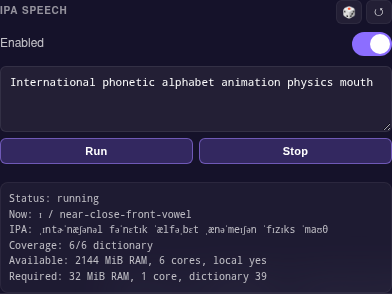

# Case study: Issue #25 - IPA-driven mouth talking animation

> Source: https://github.com/konard/anime-avatar/issues/25
>
> PR: https://github.com/konard/anime-avatar/pull/33

## Summary

Issue #25 asks for an experimental editor feature that converts English text to
IPA and then turns the IPA phoneme sequence into physically-informed mouth
animation. It also asks for a repository case study that records the issue data,
research, requirements, and possible solution plans.

This PR implements the first browser-side integration slice:

- A local `ipa-speech-browser-adapter-v0` module converts English words to IPA
  using a small built-in General American dictionary plus transparent fallback
  grapheme rules.
- The IPA phonemes are annotated with articulatory features: vowel height,
  backness, rounding, consonant place/manner, tongue position, lip posture, and
  a VRM/Oculus-style viseme class.
- The runtime maps those phonemes onto VRM mouth expression presets
  (`aa`, `ih`, `ou`, `ee`, `oh`) plus jaw-bone rotation.
- The editor gets an opt-in IPA Speech section with a toggle, text area,
  Run/Stop controls, live IPA/status display, and local resource budget.

This is not a full acoustic simulation or a production-grade English G2P model.
It is a safe experimental browser adapter that establishes the app architecture,
configuration keys, animation path, and tests needed for larger phonetic models.

## Requirements

| #   | Requirement                                                                        | Status                                                                                         |
| --- | ---------------------------------------------------------------------------------- | ---------------------------------------------------------------------------------------------- |
| R1  | Animate talking as true to real mouth/tongue physics as possible from IPA.         | Implemented as IPA-derived visemes with articulatory metadata, VRM mouth expressions, and jaw. |
| R2  | Leave a path toward 3D sound generation from air movement and mouth/tongue shapes. | Documented as a future physics/acoustics layer; not implemented in this PR.                    |
| R3  | Convert English text to IPA.                                                       | Implemented in `public/new/src/ipaSpeech.js` with dictionary plus rule fallback.               |
| R4  | Convert IPA to actual mouth animation.                                             | Implemented in `ACS_ipaSpeechDelta()` and layered through `ACS_applyAll()`.                    |
| R5  | Add a small text area and switch in the editor.                                    | Implemented as the IPA Speech editor section.                                                  |
| R6  | Keep the feature off by default and mark it experimental.                          | Implemented as `ipaSpeechEnabled: false` in defaults.                                          |
| R7  | Research existing components/libraries and best solution options.                  | Completed below.                                                                               |
| R8  | Compile issue data and analysis under `docs/case-studies/issue-25`.                | Implemented in this folder.                                                                    |

## Research

### IPA as the source representation

The International Phonetic Association publishes the official IPA chart and
subcharts. The chart organizes consonants by articulatory place/manner and
vowels by tongue height/backness and rounding. That makes IPA a useful internal
representation for mouth animation because it carries more physical information
than English spelling.

Implementation implication: the adapter should not jump directly from letters
to arbitrary mouth poses. It should create an IPA phoneme plan first, then map
each phoneme to mouth metadata and animation curves.

### English to IPA sources

CMUdict is a free English pronouncing dictionary maintained by Carnegie Mellon.
It uses ARPABET, which is practical for speech technology and can be converted
to IPA. `cmudict-ipa` provides an IPA conversion of CMUdict, and
`open-dict-data/ipa-dict` provides machine-readable IPA dictionaries including
`en_US` based on `cmudict-ipa`.

The `text-to-ipa` npm package is also relevant: it exposes a simple JavaScript
lookup interface and ships a built-in dictionary. Its package size and age make
it less attractive as an immediate dependency for this repo, but it validates
the dictionary-lookup approach.

eSpeak/eSpeak NG is the stronger future path for arbitrary English because it
has spelling-to-phoneme rules and language phoneme tables. A WebAssembly build
could produce much wider English coverage than this PR's local fallback rules.

Implementation implication: the first PR should expose an adapter boundary and
resource/status UI. A later PR can lazily load a full dictionary or eSpeak WASM
without changing the editor config shape.

### IPA to mouth shapes

VRM 1.0 defines a Mouth expression group intended for automatic generation from
speech or text analysis, with the presets `Aa`, `Ih`, `Ou`, `Ee`, and `Oh`.
These match the normalized expression names available in three-vrm and are the
right default morph targets for this app.

Rhubarb Lip Sync is audio-based rather than text/IPA-based, but its design is
still relevant: it emits timed mouth-shape cues, and its docs distinguish a
small reusable mouth-shape set from the recognizer that produced the cues. This
supports the same separation used here: G2P/IPA planning first, timed viseme
animation second.

Implementation implication: drive the common VRM vowel expressions and the jaw
bone rather than requiring a custom model-specific viseme mesh. Store richer
metadata so custom tongue/lip meshes can use it later.

## Solution Options

### Option A - Local browser IPA adapter now

Use a small built-in English IPA lexicon, transparent fallback spelling rules,
IPA articulatory metadata, VRM mouth expression weights, and jaw-bone deltas.

Pros:

- Works offline and in-browser with no server calls.
- Adds no large dependency or model download.
- Gives reviewers a working editor surface immediately.
- Keeps a stable adapter API for future G2P engines.

Cons:

- Dictionary coverage is intentionally small.
- Rule fallback is approximate for irregular English.
- Tongue and airflow are represented as metadata, not rendered geometry.

This PR uses Option A.

### Option B - Lazy-load a full IPA dictionary

Load `open-dict-data/ipa-dict` or a `cmudict-ipa` derivative when the user
enables IPA Speech.

Pros:

- Much higher English word coverage.
- Still deterministic and browser-friendly.

Cons:

- Adds download, licensing review, cache policy, and dictionary selection UI.
- Dictionary lookup alone still misses names, new words, and context-sensitive
  pronunciations.

Recommended follow-up after the adapter UI is accepted.

### Option C - eSpeak NG WebAssembly G2P

Use eSpeak/eSpeak NG in the browser to generate phonemes/IPA for arbitrary text.

Pros:

- Better generalization than dictionary-only lookup.
- Language infrastructure already models phoneme inventories.

Cons:

- Requires WASM packaging, load/error states, and browser resource checks.
- Output needs normalization into this app's IPA/viseme table.

Recommended for a deeper follow-up once asset size is acceptable.

### Option D - Audio alignment / Rhubarb-style mouth cues

Use audio analysis or forced alignment to produce timed mouth cues from actual
speech audio.

Pros:

- Better timing than text-only estimates when audio exists.
- Proven workflow for recorded dialogue.

Cons:

- Does not satisfy the issue's English-to-IPA text path by itself.
- Needs an audio source and more runtime machinery.

Useful as an optional companion to IPA Speech, not a replacement.

### Option E - Physical vocal tract and sound synthesis

Model lips, jaw, tongue, velum, and airflow to synthesize or spatialize sound.

Pros:

- Closest to the issue's ideal "real physics" goal.

Cons:

- Requires a vocal-tract geometry model, acoustic solver, and avatar-specific
  tongue/mouth meshes.
- Far beyond the current editor's model abstraction.

This remains a research track. The current phoneme metadata is structured so it
can feed such a layer later.

## Implementation Notes

New files and entry points:

- `public/new/src/ipaSpeech.js`
- `tests/ipaSpeech.test.js`

New cfg keys:

- `ipaSpeechEnabled`
- `ipaSpeechText`
- `ipaSpeechNonce`
- `ipaSpeechModel`

Runtime flow:

1. The editor toggles `ipaSpeechEnabled` and bumps `ipaSpeechNonce` on Run.
2. `ACS_createIpaSpeechPlan()` converts English words to IPA.
3. Each IPA phoneme receives mouth metadata and a timed viseme segment.
4. `ACS_ipaSpeechDelta()` samples the current segment, blends toward the next
   segment, and emits jaw rotation plus VRM mouth expression weights.
5. `ACS_applyAll()` layers the speech delta into the existing bone/expression
   pipeline.
6. `ACS_probe()` exposes IPA speech state for tests.

## Test Plan

Automated:

- `tests/ipaSpeech.test.js` verifies English-to-IPA conversion, dictionary
  coverage, fallback behavior, viseme mapping, jaw deltas, and VRM mouth
  expression deltas.
- `public/new/src/tests-registry.js` adds in-browser smoke coverage for the
  resource report, IPA plan creation, and live mouth-state progression.

Manual:

1. Open `/anime-avatar/new/?view=editor`.
2. Enable IPA Speech.
3. Type `My mouth moves`, click Run, and observe the IPA/status display.
4. Watch the jaw and VRM mouth expressions change while the phrase plays.

Screenshot:

## Sources

- International Phonetic Association chart: https://www.internationalphoneticassociation.org/content/full-ipa-chart/ipa-vowels
- CMU Pronouncing Dictionary: https://github.com/cmusphinx/cmudict
- CMUdict converted to IPA: https://github.com/menelik3/cmudict-ipa
- IPA dictionary data project: https://github.com/open-dict-data/ipa-dict
- eSpeak phoneme documentation: https://espeak.sourceforge.net/phonemes.html
- VRM 1.0 expression presets: https://vrm.dev/en/vrm1/expression/
- VRM procedural mouth expression group: https://vrm.dev/en/univrm1/vrm1_tutorial/expression/
- Rhubarb Lip Sync: https://github.com/DanielSWolf/rhubarb-lip-sync
- text-to-ipa package: https://www.jsdelivr.com/package/npm/text-to-ipa
