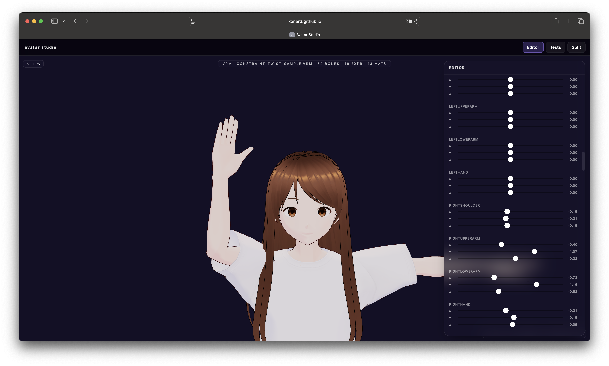

# Case study: Issue #28 — Improve waving (hi) gesture, anatomical bone limits, smooth animation blending, on-model joint controls

> Source: https://github.com/konard/anime-avatar/issues/28
>
> PR: https://github.com/konard/anime-avatar/pull/29

## Summary

Issue #28 covers four mostly-independent improvements to the avatar studio
(`public/new/src/`):

1. **Waving (`wave`) gesture is not natural.** The current bell-shaped
   envelope swings the whole forearm sideways like a windscreen wiper, but the
   reference image shows the hand raised almost vertically with the forearm
   bent at the elbow — a "hi" wave should oscillate the **hand** at the wrist,
   not the entire forearm.
2. **Bone rotation sliders are not anatomical.** Each rotation axis on every
   bone is offered the same `[-2.2, 2.2]` rad range (arms) regardless of
   whether the joint can biologically move that way. There is nothing
   stopping a user (or randomizer) from rotating an elbow backwards or
   stretching a knee inward. Numbers are also displayed in raw radians, which
   are unintuitive.
3. **Animations don't blend smoothly.** When idle gaze tracking is on and the
   user clicks the `nod` or `shake` gesture, the head jumps because:
   - Programmatic gestures **replace** look-at head contributions for their
     entire duration (head bone is locked to gesture rotation while
     `gestureActive`, then suddenly handed back to the smoother).
   - The look-at smoother is reset across the discontinuity.
   The result is a visible snap at gesture start and gesture end.
4. **There is no on-model rotation gizmo.** All rotation control lives in the
   side drawer; users have asked for the editor-style ring gizmos shown in
   most 3D editors (Blender / Unity / VRoid), one ring per axis around the
   currently-selected joint, with hover/tap to switch joints. Both desktop
   and mobile control flows should work.

This case study compiles the requirements, the anatomical reference data, the
relevant three.js / VRM library affordances, the proposed solution, and the
remaining open questions.

## Requirements (from the issue)

| #   | Requirement                                                                                                                                                  |
| --- | ------------------------------------------------------------------------------------------------------------------------------------------------------------ |
| R1  | Improve the `wave` gesture so the hand oscillates at the wrist, with a raised forearm, matching the reference image.                                         |
| R2  | Default to **anatomically possible** rotations only — every joint slider must clamp to its biological range (per axis).                                      |
| R3  | Display rotations as **degrees** in `−360..0..360` range (clamped to anatomical limits where relevant).                                                      |
| R4  | Add an optional in-viewport joint gizmo (rings around each axis, similar to Blender / Unity). One joint visible at a time; hover (desktop) / tap (mobile) to switch joints. Off by default. |
| R5  | Confirm full mobile + desktop support (touch & pointer interaction). Experimental — off by default.                                                          |
| R6  | All animations should additively combine (relative deltas, summed each frame); transitions between gestures / look-at / idle must be smooth (no snaps).      |
| R7  | Specifically: `yes` (nod) and `no` (shake) gestures should overlay on top of camera tracking instead of replacing it, and start/end without jumps.           |
| R8  | Compile this case study at `docs/case-studies/issue-28/` with timeline, requirements, root causes, libraries researched, and proposed solutions.             |

## Reference image

The reference shows the right arm raised so the hand is **above the head**
(upper arm rotated up ~−90° around the local Z axis from VRM rest), the
forearm bent ~90° forward (negative X on `rightLowerArm`), and the hand
kept roughly vertical with the palm forward — a classic open-hand greeting.
The motion to look natural needs to oscillate the hand left/right at the
wrist (Y rotation on `rightHand`) while the upper arm and forearm stay
roughly still during the wave's plateau.

## Reproductions

All reproductions assume the studio is open at `/anime-avatar/new/?view=editor`
with the default pixiv VRM 1.0 sample loaded.

### R1 — Wave looks like a windscreen wiper

1. Open the studio, leave the default model loaded.
2. Click `Gestures & Mood → Wave (hello/hi)`.
3. Observe: the right upper arm rotates up to about half-mast (z ≈ −0.95
   rad, i.e. arm horizontal-ish), and the **forearm** swings sideways at the
   shoulder — not the wrist. The hand barely contributes (`y * 0.4`).

Code path: `public/new/src/gestures.js`, the `wave` branch (~lines 42-55).

### R2 — Sliders allow anatomically impossible rotations

1. In the drawer, scroll to `Bones · arms`.
2. Drag `leftLowerArm.x` to its minimum (−2.2 rad ≈ −126°) and observe: the
   forearm hyperextends backward through the elbow, deforming the mesh.
3. Drag `leftLowerArm.y` to either extreme: the forearm twists 130° around
   the long axis, which the elbow physically cannot do (the radius/ulna
   stop at ~85° supination / ~75° pronation).

Code path: `public/new/src/Editor.jsx::renderBoneGroup` (`ranges` map, ~lines
628-634) hardcodes the same range for every bone in the same group.

### R3 — Rotations shown in radians, not degrees

Same code path. Sliders show e.g. `1.20` for ~69°.

### R6/R7 — Nod jumps when camera follow is on

1. Make sure `Idle Animation → Follow camera` is on, with both `eyes` and
   `head` chips active (default).
2. Click `Gestures → Nod (yes)`.
3. Observe: at the instant nod starts, the head snaps from its current
   smoothed look-at angle to (mostly) zero, plays the nod, and snaps back
   to look-at at the end of the gesture.

Code path: `public/new/src/apply.js::applyLookAt` (~lines 488-494) gates
`head.rotation += idle.headYawCur` on `!animActive && !gestureActive`. At
the gesture boundary `idle.headYawCur` is non-zero but the head bone is
suddenly authoritative again; no inter-frame smoothing covers the seam.

### R4/R5 — No on-model joint controls exist

Currently the only way to rotate a single joint is via the drawer sliders —
no in-viewport gizmo, no hover-to-select, no tap-to-select. There is no
mode switch in the UI for an "edit on model" flow.

## Root causes

### RC1 — `wave` gesture animates the wrong joint

`gestures.js` puts the **oscillation** on `rightLowerArm.y` (forearm twist),
not on `rightHand.y` (wrist). The hand only gets `0.4 *` the same signal,
which is too small to read as a wave. To match the reference image we want:

- `rightUpperArm`: held at `z ≈ −1.2` rad (arm raised vertically, ~−69°
  from rest along Z) and a small `x ≈ −0.3` rad (slight forward swing) —
  these are quasi-static during the wave.
- `rightLowerArm`: held at `x ≈ −1.5` rad (forearm bent ~−86°, almost a
  right angle), with **no** continuous oscillation.
- `rightHand`: oscillating `z` (or `y`) component over ~3 cycles —
  amplitude ~0.6 rad, frequency tied to the gesture envelope so it ramps in
  and out.
- Slight head tilt + happy expression layered on top (kept from the
  current implementation).

### RC2 — No per-bone, per-axis rotation limits

`renderBoneGroup` shares a single `{min, max}` for the whole group. No
limits are enforced inside `apply.js` either — the merged rotation value
flows straight into the `Euler` and onto the bone. Randomizers in
`randomizers.js` use the same shared bounds and can produce poses that
deform the mesh.

### RC3 — Sliders display radians

Every slider shows `value.toFixed(2)` of the raw radian value. Anatomy
references and 3D editors universally use degrees, so the UI is harder to
reason about than it needs to be.

### RC4 — Gestures replace bone rotations during their entire window

`apply.js` zeroes the bone quaternion to rest, then adds `merged + gesture
delta`. While `gestureActive`, `applyLookAt` skips writing
`head.rotation += idle.headYawCur` (lines 488-494). At the boundary of the
gesture window, that contribution is suddenly added back at full strength
(or removed). Result: a single-frame jump.

### RC5 — No in-viewport rotation gizmo

three.js ships `TransformControls` (`three/addons/controls/TransformControls.js`)
which can target a `THREE.Object3D` (including a humanoid bone node) and
display per-axis rotation rings in rotate mode — but the studio has not yet
wired one up. The drawer sliders are the only path.

## Libraries / prior art reviewed

- **three.js `TransformControls`** — gizmo helper for rotate/translate/scale,
  attaches to any `Object3D`, shows three colored rings in rotate mode,
  works with both mouse and touch via the underlying pointer events. Docs:
  [TransformControls](https://threejs.org/docs/?q=transform#examples/en/controls/TransformControls).
  Caveat: it owns its own pointer events while dragging — needs to be
  paired with `OrbitControls` enable/disable on `dragging-changed` so the
  camera doesn't fight the gizmo.
- **`AnimationUtils.makeClipAdditive` / `THREE.AdditiveAnimationBlendMode`** —
  the canonical way to layer multiple clips. We don't need it for our
  programmatic gesture path (we already mix Eulers in `mergePose`), but the
  same principle applies: gestures should produce a **delta** that is added
  to whatever else is moving the bone, not a replacement that gates other
  systems out.
- **VRM Humanoid spec** — defines the canonical bone names and the rest pose
  as T-pose for VRM 1.0. The bone naming we already use
  (`rightUpperArm`, `rightLowerArm`, `rightHand`) is the standard set; any
  joint-limit system we build keys on those names is portable across all
  VRM models.
- **VRM `lookAt`** — already correctly handled per-version (issue #26 fix).
  Our smoother in `applyLookAt` is the right place to add additive
  gesture-on-top behaviour, since the head bone smoothing already exists.
- **Anatomical references** — see "Anatomical limits" below for the
  numbers we'll actually use.

## Anatomical limits we will enforce

Sources:

- [Healthline — Normal shoulder ROM](https://www.healthline.com/health/shoulder-range-of-motion)
- [PMC: Shoulder range of movement, age & gender stratified normative data](https://pmc.ncbi.nlm.nih.gov/articles/PMC7549223/)
- [PMC: Normative values for elbow ROM](https://pmc.ncbi.nlm.nih.gov/articles/PMC6555111/)
- [DSHS WA — Range of Joint Motion Evaluation Chart (PDF)](https://www.dshs.wa.gov/sites/default/files/forms/pdf/13-585a.pdf)

These limits represent **healthy adult ROM** for the named axis; we round
generously so animation poses don't feel stiff. All numbers in degrees,
positive sign matches the VRM normalized humanoid frame (rest = T-pose for
VRM 1.0; left/right are the **character's** sides):

| Bone group       | Axis | Min   | Max  | Notes                                                                                  |
| ---------------- | ---- | ----- | ---- | -------------------------------------------------------------------------------------- |
| Head/neck        | x    | −60°  | 60°  | flexion / extension                                                                    |
| Head/neck        | y    | −80°  | 80°  | yaw left/right                                                                         |
| Head/neck        | z    | −45°  | 45°  | lateral tilt                                                                           |
| Spine / chest    | x    | −30°  | 60°  | forward bend / backward arch                                                           |
| Spine / chest    | y    | −45°  | 45°  | torso twist                                                                            |
| Spine / chest    | z    | −30°  | 30°  | side-bend                                                                              |
| Hips             | y    | −30°  | 30°  | hip rotation                                                                           |
| Shoulder (Upper Arm Z) | z    | −180° | 30°  | left side: −180 raises straight up; positive = arm down / across — biological max ~30° behind body |
| Shoulder (Upper Arm Z, right) | z    | −30°  | 180° | mirror of the left side                                                                |
| Shoulder (Upper Arm X) | x    | −90°  | 90°  | flexion / extension                                                                    |
| Shoulder (Upper Arm Y) | y    | −90°  | 90°  | internal/external rotation                                                             |
| Lower Arm (Elbow X)   | x    | −150° | 0°   | elbow only flexes (negative X) from straight to fully bent                             |
| Lower Arm (Elbow Y)   | y    | −90°  | 90°  | forearm pronation / supination                                                         |
| Lower Arm (Elbow Z)   | z    | −10°  | 10°  | elbow has no Z axis, allow tiny tolerance                                              |
| Hand (Wrist X)        | x    | −80°  | 80°  | flexion / extension                                                                    |
| Hand (Wrist Y)        | y    | −60°  | 60°  | radial / ulnar deviation                                                               |
| Hand (Wrist Z)        | z    | −30°  | 30°  | tiny twist tolerance                                                                   |
| Upper Leg X      | x    | −30°  | 120° | hip flexion / extension                                                                |
| Upper Leg Y      | y    | −45°  | 45°  | hip rotation                                                                           |
| Upper Leg Z      | z    | −45°  | 45°  | abduction / adduction                                                                  |
| Lower Leg (Knee X) | x    | 0°  | 150° | knee only flexes                                                                       |
| Lower Leg Y/Z      | -    | small | small | knee has no twist                                                                      |
| Foot X        | x    | −50°  | 50°  | dorsiflexion / plantarflexion                                                          |
| Foot Y        | y    | −30°  | 30°  | inversion / eversion                                                                   |
| Eyes          | x/y  | −20°  | 20°  | eye saccade limit                                                                      |
| Fingers       | z    | −10°  | 100° | finger flexion only                                                                    |

We expose these limits as a `window.ACS_BONE_LIMITS` table keyed by the
VRM humanoid bone name, and use it both to (a) bound the slider range and
(b) clamp values inside `apply.js` so any code path (preset, gesture,
animation, randomizer) is held to the same ceiling.

The clamp is **soft** — values still flow through linearly inside the
allowed range — so existing presets that set, e.g., `leftLowerArm.x =
−1.2` rad (≈ −69°) keep working.

## Proposed solution

### S1 — Bone limit table (`constants.js`)

Add `window.ACS_BONE_LIMITS` (degrees, per axis, with `min` / `max`).
Mirror entries on the left/right sides automatically. Provide a
`window.ACS_clampBoneEulerDeg(bone, axis, deg)` helper.

### S2 — Wave gesture rewrite (`gestures.js`)

Hold the upper arm raised (`z=-1.2`, slight forward `x=-0.3`) and the
forearm bent (`x=-1.5`) for the gesture's plateau. Oscillate the **hand**
on the Z axis (the wrist's natural roll into-and-out-of-the-palm) — three
cycles, amplitude scaled to the envelope, multiplied by mood `ampScale`.
The current happy-expression overlay stays as-is.

### S3 — Rotation sliders show degrees (`Editor.jsx`)

Convert the cfg values (still stored in radians for engine compatibility)
to degrees on display, accept user input in degrees, convert back on write.
Use the per-bone-per-axis limits from S1 for the slider min/max. Keep the
internal cfg shape unchanged so existing config JSON files keep loading.

### S4 — Smooth gesture / look-at blending (`apply.js`)

Stop gating `head.rotation += idle.headYawCur` on `!gestureActive`. Keep
the look-at smoother running every frame (it already decays to zero when
no source is enabled). Gestures contribute on top — `head` is already
additive in the bone merge step. Add a small "gesture intensity" smoother
so a gesture's head deltas ramp in over ~120 ms (not just envelope's
plateau) when starting from a non-zero look-at base, eliminating the
seam.

For the look-at smoother to survive a gesture cleanly, the smoother's
`headYawCur`/`headPitchCur` must keep advancing during the gesture. Since
those values feed `head.rotation` directly, allowing both to write to
`head.rotation` (look-at first, gesture overlay second) does the right
thing — additive combination — without introducing a new system.

### S5 — In-viewport joint controls (`Editor.jsx` + new `joint-controls.jsx`)

Off by default behind a `cfg.experimentalJointControls` flag, exposed in
the `Behaviour` section. When enabled:

- A new toggle `cfg.jointControlsActive` shows three rotation rings
  (X / Y / Z color-coded red / green / blue) anchored to the **currently
  selected** humanoid bone.
- Hover (desktop pointer move) over any humanoid bone area selects it; on
  mobile, tap-on-canvas selects the nearest bone within a tap radius.
- Drag a ring to rotate that axis, with the same anatomical clamp
  (rings visually bounce at the limit).
- Implementation uses `three/addons/controls/TransformControls.js` set
  to `'rotate'` mode, attached to `vrm.humanoid.getNormalizedBoneNode(b)`.
  We hook `dragging-changed` to disable `OrbitControls` while dragging
  the gizmo so the camera doesn't fight the rotation.

This is the experimental piece — we will land it behind a feature flag so
the default UX is unchanged.

### S6 — Smarter gesture+gaze defaults

Default `cfg.lookCameraHeadAmount` already implies ~40 % head carry
during camera-tracking. With S4 in place, nodding the head while the
camera-tracking is on will look natural: the head still gently follows the
camera, and the nod is layered on top.

## Test plan

We add three layers of automated coverage:

1. **Pure-function unit tests in `tests/` (vitest)** — the `clampBoneEulerDeg`
   helper, mirror-side resolution, and the Euler ↔ degrees conversion
   round-trip.
2. **Editor in-browser smoke tests in `public/new/src/tests-registry.js`** —
   the existing test runner exercises the React app. We add:
   - "wave gesture oscillates the wrist, not the lower arm"
   - "joint control gizmo appears when toggled on, disappears off"
   - "head bone keeps tracking camera during a nod gesture"
   - "rotation slider clamps to the bone limit on extreme drag"
3. **Headless math reproduction in `experiments/issue-28-bone-limits.mjs`** —
   prints, for a synthetic config, the clamped vs. raw Euler values per
   bone so future maintainers can verify the limit table without booting
   the editor.

## Open questions / out-of-scope for this PR

- Per-finger limits are very simplified; a future PR may model the
  metacarpal-phalangeal vs. proximal-interphalangeal joint differences if
  hand-pose editing becomes a focus.
- The "experimental on-model joint control" gizmo is an opt-in stub — it
  can move to default-on once we've gathered usability feedback.
- We do not attempt to reproduce the smooth blending behaviour for FBX
  retargeted animations (Mixamo) — those replace bones via the
  `AnimationMixer` and live outside the gesture/look-at additive system.
  That is a separate change tracked in a future issue.

## Files touched (planned)

- `public/new/src/constants.js` — `ACS_BONE_LIMITS`, helper.
- `public/new/src/gestures.js` — rewritten `wave` branch.
- `public/new/src/apply.js` — additive head blending across gesture
  boundary.
- `public/new/src/Editor.jsx` — degrees-in-UI, per-axis slider ranges,
  optional gizmo wiring + experimental flag.
- `public/new/src/defaults.js` — flag defaults.
- `public/new/src/randomizers.js` — randomizers respect bone limits.
- `public/new/src/tests-registry.js` — new in-browser tests.
- `tests/boneLimits.test.js` — new unit tests.
- `experiments/issue-28-bone-limits.mjs` — new headless verification
  script.

## Sources

- [Healthline — Understanding the Normal Shoulder Range of Motion](https://www.healthline.com/health/shoulder-range-of-motion)
- [PMC — Shoulder range of movement in the general population](https://pmc.ncbi.nlm.nih.gov/articles/PMC7549223/)
- [PMC — Normative values and affecting factors for the elbow range of motion](https://pmc.ncbi.nlm.nih.gov/articles/PMC6555111/)
- [DSHS WA — Range of Joint Motion Evaluation Chart](https://www.dshs.wa.gov/sites/default/files/forms/pdf/13-585a.pdf)
- [three.js docs — TransformControls](https://threejs.org/docs/?q=transform#examples/en/controls/TransformControls)
- [three.js docs — AnimationUtils.makeClipAdditive](https://threejs.org/docs/?q=animation#api/en/animation/AnimationUtils.makeClipAdditive)
- [pixiv/three-vrm humanoidAnimation example](https://github.com/pixiv/three-vrm/tree/main/packages/three-vrm/examples)
