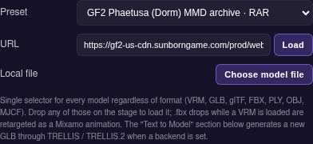

# Case study: Issue #39 - GF2 Exilium official art model archives

> Issue: https://github.com/konard/anime-avatar/issues/39
>
> Prepared PR: https://github.com/konard/anime-avatar/pull/40
>
> Source page: https://gf2exilium.sunborngame.com/main/art

## 1. Issue summary

The issue asks the new anime avatar studio to support character models from
the official `gf2exilium.sunborngame.com/main/art` page in the same model
selector flow used by the existing studio presets.

It also asks for a case-study folder with collected data, online research,
requirements, alternatives, and an implementation plan. This folder contains:

- `issue-body.md` and `issue-body.json` - captured issue details.
- `issue-comments.json` - captured issue comments. There were no comments at
  the time of capture.
- `gf2-art-model-archives.json` - the extracted official model archive
  inventory used by the implementation.
- `screenshots/01-gf2-model-preset.png` - browser verification of a selected
  GF2 archive preset in the model selector.

## 2. Source analysis

On 2026-05-21, the official art page returned a small Vue shell that loaded:

- `https://gf2-us-cdn.sunborngame.com/prod/website/official_zf/pc/dist/bundle.1778670157059_389de467a7.js`
- `https://gf2-us-cdn.sunborngame.com/prod/website/official_zf/pc/dist/169.bundle.1778670157059_d0a537031c.js`
- `https://gf2-us-cdn.sunborngame.com/prod/website/official_zf/pc/dist/708.bundle.1778670157059_f7b226b1ac.js`

The art route's chunk exposes a `MMD MODELS` section and a webpack download
context mapping display filenames such as `Phaetusa(Dorm).rar` to hashed CDN
archive URLs such as:

```text
https://gf2-us-cdn.sunborngame.com/prod/website/official_zf/pc/zip/Phaetusa(Dorm)_e2901aa602.rar
```

Inventory extracted from the official page:

| Type                     | Count |
| ------------------------ | ----: |
| RAR model archives       |   115 |
| ZIP model archives       |    19 |
| Total MMD model archives |   134 |

The same chunk also exposes one theme-song archive. It is intentionally not
included in `ACS_MODEL_PRESETS` because it is not a character model.

Spot checks:

| Archive                              | HEAD result                               | Notes       |
| ------------------------------------ | ----------------------------------------- | ----------- |
| `Phaetusa(Dorm)_e2901aa602.rar`      | HTTP 200, `binary/octet-stream`, 50.62 MB | RAR archive |
| `Leva (Sultry Tempo)_bb6e25da88.zip` | HTTP 200, `application/zip`, 42.04 MB     | ZIP archive |

## 3. Requirement inventory

| #   | Requirement                                                            | Implementation response                                                                                                                              |
| --- | ---------------------------------------------------------------------- | ---------------------------------------------------------------------------------------------------------------------------------------------------- |
| R1  | Collect issue data in `docs/case-studies/issue-39`.                    | Added issue capture files, this analysis, and the extracted archive inventory JSON.                                                                  |
| R2  | Search and inspect the official GF2 art source.                        | Parsed the live official page shell, route chunks, and download context.                                                                             |
| R3  | Support GF2 character models in the new studio.                        | Added all 134 official MMD model archives to `window.ACS_MODEL_PRESETS`.                                                                             |
| R4  | Keep support in the same model selector flow as other models.          | GF2 entries appear in the central `Model` preset dropdown with `RAR`/`ZIP` format labels.                                                            |
| R5  | Avoid pretending browser runtime can parse archive packages as meshes. | ZIP/RAR are detected as model archive formats, opened as downloads from presets, and rejected by low-level loaders with a clear download-only error. |
| R6  | Add regression coverage.                                               | Added tests for ZIP/RAR detection, the 134-entry inventory, and the no-fetch download-only loader guard.                                             |

## 4. Format constraints

The current studio can render direct runtime model files such as VRM, GLB,
glTF, FBX, PLY, OBJ, and MJCF. The GF2 art page publishes MMD model packages
as ZIP/RAR archives instead of single browser-ready model URLs.

That matters because direct in-browser rendering would require at least:

- archive extraction in the browser;
- RAR support, likely through a separate library or WebAssembly;
- MMD PMX/PMD parsing through a loader such as three.js `MMDLoader`;
- material and texture path resolution inside the extracted package.

That is materially different from the existing direct-file loader path and
would add a large binary/archive parsing surface. The practical support for
this PR is therefore:

1. Make the official GF2 model packages discoverable from the existing model
   selector.
2. Open the official CDN archive URL when the user selects one.
3. Teach the dispatcher that ZIP/RAR are known model package formats so custom
   archive URLs fail with a clear "download-only" message rather than
   "unknown format" or an attempted GLB parse.

## 5. Solution plan

| Area             | Change                                                                                                                                                            |
| ---------------- | ----------------------------------------------------------------------------------------------------------------------------------------------------------------- |
| Preset data      | Add `window.ACS_GF2_MMD_MODEL_ARCHIVES` generated from the official art chunk and spread it into `window.ACS_MODEL_PRESETS`.                                      |
| Format detection | Extend `ACS_detectModelFormat` with `.zip`, `.rar`, `application/zip`, `application/x-zip-compressed`, `application/vnd.rar`, and `application/x-rar-compressed`. |
| Runtime loader   | Reject `zip` and `rar` before fetching or parsing, with an explicit archive download-only message.                                                                |
| Editor UX        | For ZIP/RAR selections, open the official URL in a new tab instead of routing into mesh loaders.                                                                  |
| Tests            | Assert the official representative ZIP/RAR URLs, exact inventory count, sample metadata, and no-fetch archive guard.                                              |

## 6. Verification target

The minimum complete verification for this issue is:

```bash
npm run test -- tests/modelLoader.test.js
npm run test
npm run check
npm run build
```

For visual review, open `/new/`, use the `Model` preset dropdown, and verify
the GF2 entries appear with `RAR`/`ZIP` labels.


