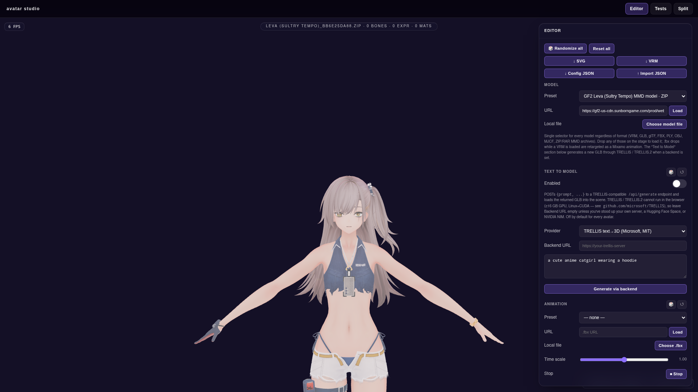

# Case study: Issue #39 - GF2 Exilium official art model archives

> Issue: https://github.com/konard/anime-avatar/issues/39
>
> Prepared PR: https://github.com/konard/anime-avatar/pull/40
>
> Source page: https://gf2exilium.sunborngame.com/main/art

## 1. Issue summary

The issue asks the new anime avatar studio to support character models from
the official `gf2exilium.sunborngame.com/main/art` page in the same model
selector flow used by the existing studio presets.

It also asks for a case-study folder with collected data, online research,
requirements, alternatives, and an implementation plan. This folder contains:

- `issue-body.md` and `issue-body.json` - captured issue details.
- `issue-comments.json` - captured issue comments. There were no comments at
  the time of capture.
- `gf2-art-model-archives.json` - the extracted official model archive
  inventory used by the implementation.
- `screenshots/01-gf2-model-preset.png` - browser verification of a selected
  GF2 archive preset in the model selector.
- `screenshots/02-gf2-leva-mmd-loaded.png` - browser verification that the
  official Leva ZIP archive extracts and renders in the editor.

## 2. Source analysis

On 2026-05-21, the official art page returned a small Vue shell that loaded:

- `https://gf2-us-cdn.sunborngame.com/prod/website/official_zf/pc/dist/bundle.1778670157059_389de467a7.js`
- `https://gf2-us-cdn.sunborngame.com/prod/website/official_zf/pc/dist/169.bundle.1778670157059_d0a537031c.js`
- `https://gf2-us-cdn.sunborngame.com/prod/website/official_zf/pc/dist/708.bundle.1778670157059_f7b226b1ac.js`

The art route's chunk exposes a `MMD MODELS` section and a webpack download
context mapping display filenames such as `Phaetusa(Dorm).rar` to hashed CDN
archive URLs such as:

```text
https://gf2-us-cdn.sunborngame.com/prod/website/official_zf/pc/zip/Phaetusa(Dorm)_e2901aa602.rar
```

Inventory extracted from the official page:

| Type                     | Count |
| ------------------------ | ----: |
| RAR model archives       |   115 |
| ZIP model archives       |    19 |
| Total MMD model archives |   134 |

The same chunk also exposes one theme-song archive. It is intentionally not
included in `ACS_MODEL_PRESETS` because it is not a character model.

Spot checks:

| Archive                              | HEAD result                               | Notes       |
| ------------------------------------ | ----------------------------------------- | ----------- |
| `Phaetusa(Dorm)_e2901aa602.rar`      | HTTP 200, `binary/octet-stream`, 50.62 MB | RAR archive |
| `Leva (Sultry Tempo)_bb6e25da88.zip` | HTTP 200, `application/zip`, 42.04 MB     | ZIP archive |

## 3. Requirement inventory

| #   | Requirement                                                   | Implementation response                                                                                                                                |
| --- | ------------------------------------------------------------- | ------------------------------------------------------------------------------------------------------------------------------------------------------ |
| R1  | Collect issue data in `docs/case-studies/issue-39`.           | Added issue capture files, this analysis, visual evidence, and the extracted archive inventory JSON.                                                   |
| R2  | Search and inspect the official GF2 art source.               | Parsed the live official page shell, route chunks, and download context.                                                                               |
| R3  | Support GF2 character models in the new studio.               | Added all 134 official MMD model archives to `window.ACS_MODEL_PRESETS` and load ZIP/RAR archives by extracting PMX/PMD packages in the browser.       |
| R4  | Keep support in the same model selector flow as other models. | GF2 entries appear in the central `Model` preset dropdown with `RAR`/`ZIP` format labels and load through the normal model dispatcher.                 |
| R5  | Actually render the official archive packages.                | Added browser archive extraction, MMDLoader integration, texture path remapping, static-model disposal, and local `.zip`/`.rar` drag-and-drop support. |
| R6  | Add regression coverage.                                      | Added unit coverage for archive extraction and browser tests for the GF2 selector inventory plus editor ZIP archive rendering.                         |

## 4. Format constraints

The studio can render direct runtime model files such as VRM, GLB, glTF, FBX,
PLY, OBJ, and MJCF. The GF2 art page publishes MMD model packages as ZIP/RAR
archives instead of single browser-ready model URLs.

The implementation now handles those constraints directly:

- ZIP and RAR archives are extracted in the browser through a vendored
  `libarchive.js` 2.0.2 runtime.
- Extracted PMX/PMD files are parsed with three.js `MMDLoader`.
- Extracted textures and sibling assets are converted to blob URLs.
- A `THREE.LoadingManager` URL modifier maps MMD relative asset paths back to
  the extracted blob URLs.
- The loaded MMD result is inserted as a static scene model and disposed when a
  different model replaces it.

This renders the official meshes and textures as static MMD models. They do
not become VRM humanoid avatars, so VRM-only controls such as humanoid bone
editing and expressions still apply only to VRM models.

## 5. Solution plan

| Area             | Change                                                                                                                                                            |
| ---------------- | ----------------------------------------------------------------------------------------------------------------------------------------------------------------- |
| Preset data      | Add `window.ACS_GF2_MMD_MODEL_ARCHIVES` generated from the official art chunk and spread it into `window.ACS_MODEL_PRESETS`.                                      |
| Format detection | Extend `ACS_detectModelFormat` with `.zip`, `.rar`, `application/zip`, `application/x-zip-compressed`, `application/vnd.rar`, and `application/x-rar-compressed`. |
| Archive runtime  | Vendor `libarchive.js` 2.0.2 browser assets so ZIP and RAR archives can be extracted client-side.                                                                 |
| MMD loader       | Load extracted PMX/PMD files with three.js `MMDLoader` and remap extracted texture paths through blob URLs.                                                       |
| Editor UX        | Route GF2 selections and local `.zip`/`.rar` drops through the normal model loading path and display them as static scene models.                                 |
| Tests            | Assert archive extraction behavior, exact inventory count, selector contents, and editor ZIP rendering.                                                           |

## 6. Verification target

The minimum complete verification for this issue is:

```bash
npm run test -- tests/modelLoader.test.js
npm run test
npm run check
npm run build
```

Local verification on 2026-05-21:

- `npm run test -- tests/modelLoader.test.js` passed.
- `npm run test` passed.
- `npm run check` passed with existing function-length warnings.
- `npm run build` passed.
- Browser GF2 tests passed for selector inventory and editor ZIP rendering.
- Playwright loaded `GF2 Leva (Sultry Tempo) MMD model` from the official CDN
  ZIP URL as `format: "zip"`, `kind: "mmd"`, with 42 extracted files and
  `Leva (Sultry Tempo)/GirlsFrontline LevaSummer.pmx`.

For visual review, open `/new/`, use the `Model` preset dropdown, select a GF2
entry, and verify the archive loads as a static MMD model in the stage.



