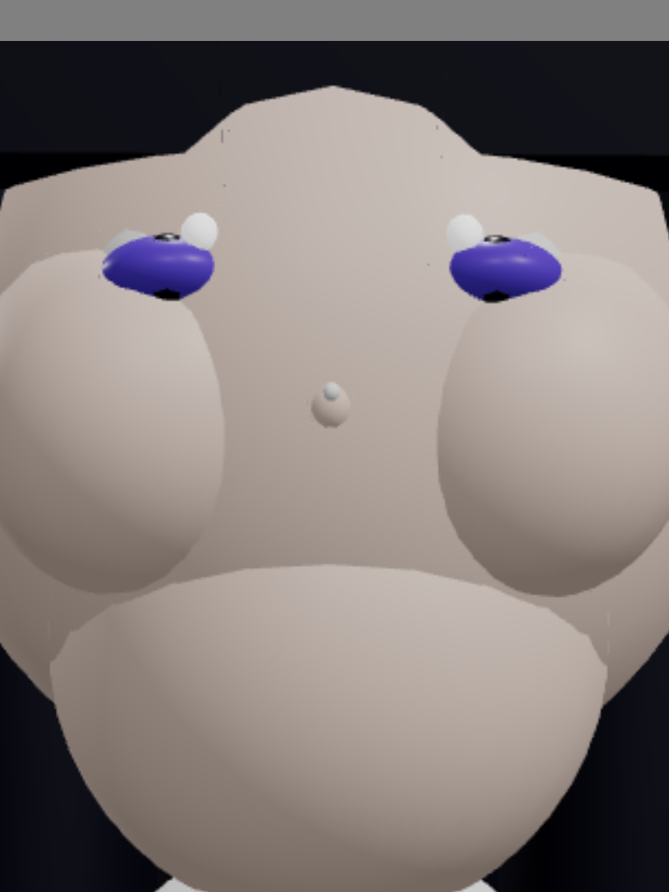

# Avatar Render Comparison Report

Generated: 2026-01-24T20:29:09.488Z

## Summary

| Model | Mode | Difference | Target | Status |
| ----- | ---- | ---------- | ------ | ------ |
| Alice | 2D   | 56.85%     | ≤10%   | ⚠️ WIP |
| Alice | 3D   | 83.98%     | ≤10%   | ⚠️ WIP |

## Comparison Method

Images are compared using **landmark-based alignment** followed by pixel comparison:

1. **Landmark Detection**: Detect facial features (purple eyes for Alice) in both images
2. **Scale Calculation**: Calculate scale factor based on inter-eye distance ratio
3. **Alignment**: Translate and scale render to align nose position with reference
4. **Comparison**: Perform pixel comparison using pixelmatch with 0.1 threshold

This approach ensures that visual similarity is measured independent of camera/viewport positioning differences.

## Visual Comparison

### Alice 2D (SVG)

| Reference                                                | Render                         | Aligned Render                   | Diff                       |
| -------------------------------------------------------- | ------------------------------ | -------------------------------- | -------------------------- |
|  |  |  |  |

### Alice 3D (WebGL)

| Reference                                                | Render                         | Aligned Render                   | Diff                       |
| -------------------------------------------------------- | ------------------------------ | -------------------------------- | -------------------------- |
|  |  |  |  |

## Details

The goal is to achieve ≤10% difference between rendered avatars and reference images.
Current renders are procedural (SVG/WebGL) approximations of the detailed anime reference artwork.

### Files Generated

- `alice-2d-render.png` - Original render screenshot
- `alice-2d-aligned.png` - Render aligned to match reference landmarks
- `alice-2d-diff.png` - Pixel difference visualization (aligned vs reference)
- `alice-3d-render.png` - Original render screenshot
- `alice-3d-aligned.png` - Render aligned to match reference landmarks
- `alice-3d-diff.png` - Pixel difference visualization (aligned vs reference)

### Reference Images

- `reference-images/alice/2d-reference.png` - Alice 2D target
- `reference-images/alice/3d-reference.png` - Alice 3D target

## How to Improve

1. Improve eye shape and proportions to better match anime style
2. Improve hair silhouette and shading
3. Add more detailed facial features (nose highlight, mouth detail)
4. Refine clothing details and sailor uniform styling
5. Improve overall character proportions
