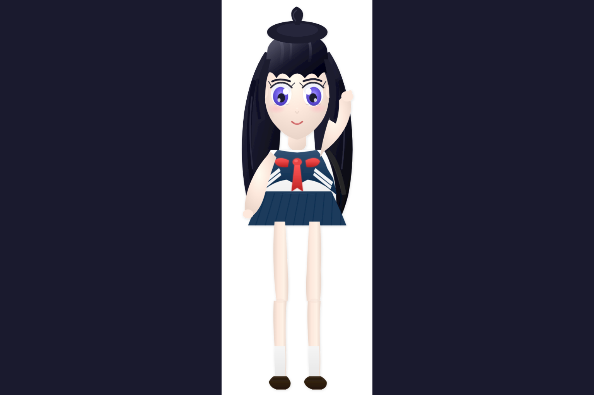
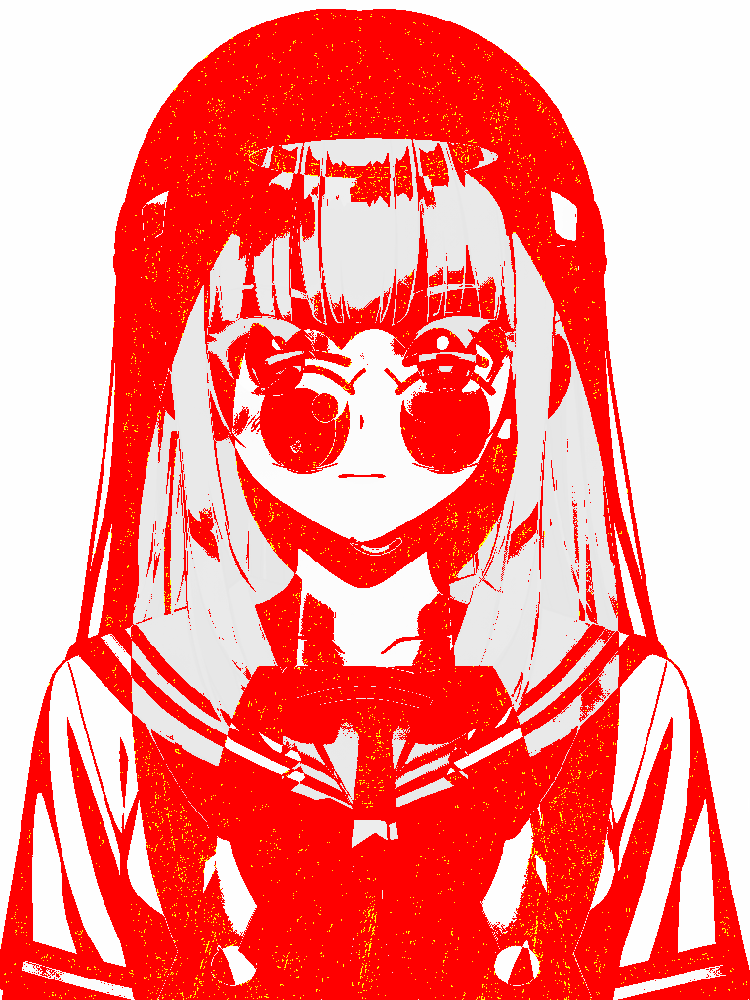
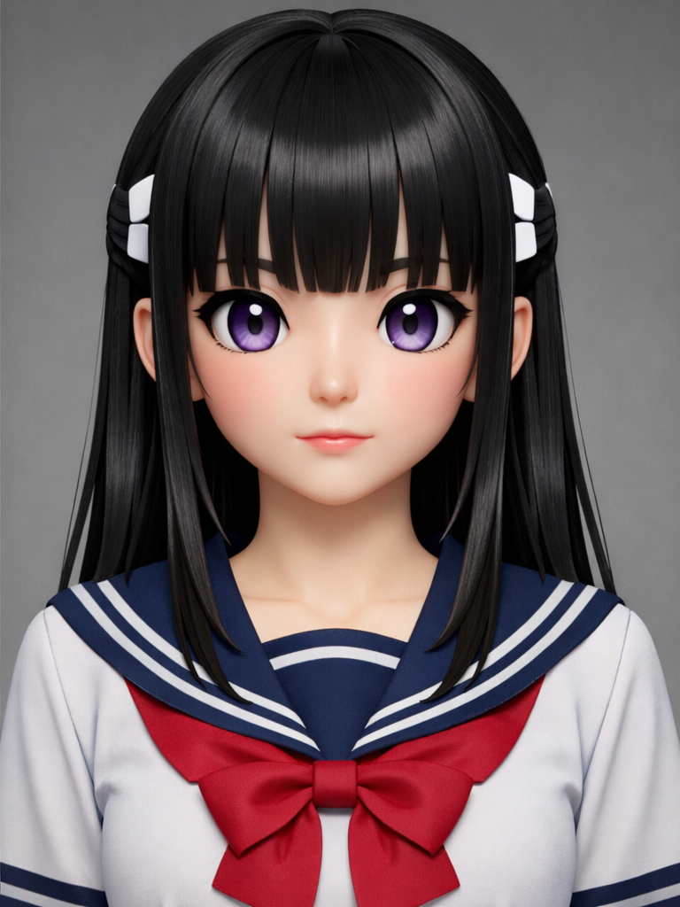
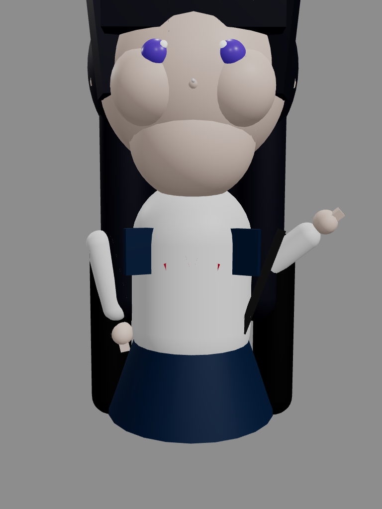

# Avatar Render Comparison Report

Generated: 2026-01-24T21:21:48.317Z

## Summary

| Model | Mode | Difference | Target | Status |
| ----- | ---- | ---------- | ------ | ------ |
| Alice | 2D   | 45.78%     | ≤10%   | ⚠️ WIP |
| Alice | 3D   | 69.31%     | ≤10%   | ⚠️ WIP |

## Comparison Method

Images are compared using **direct pixel comparison** with **render-level alignment**:

1. **Render-level alignment**: Position and scale are controlled via URL parameters
   - `scale`: Overall character scale
   - `viewportCenterY`: Vertical centering for 2D SVG
   - `cameraY`, `cameraZ`: Camera position for 3D
   - `staticPose`: Arms at rest position
   - `noAhoge`: Disable hair tuft
2. **Dimension matching**: Renders are center-cropped/padded to match reference dimensions
3. **Comparison**: Direct pixel comparison using pixelmatch with 0.1 threshold

**No post-processing transformation** is applied to the renders. This ensures we test the actual render quality, not image manipulation.

## Visual Comparison

### Alice 2D (SVG)

| Reference                                                | Render                         | Diff                       |
| -------------------------------------------------------- | ------------------------------ | -------------------------- |
|  |  |  |

### Alice 3D (WebGL)

| Reference                                                | Render                         | Diff                       |
| -------------------------------------------------------- | ------------------------------ | -------------------------- |
|  |  |  |

## Details

The goal is to achieve ≤10% difference between rendered avatars and reference images.
Current renders are procedural (SVG/WebGL) approximations of the detailed anime reference artwork.

### Files Generated

- `alice-2d-render.png` - Render screenshot (alignment done at render level)
- `alice-2d-diff.png` - Pixel difference visualization (render vs reference)
- `alice-3d-render.png` - Render screenshot (alignment done at render level)
- `alice-3d-diff.png` - Pixel difference visualization (render vs reference)

### Reference Images

- `reference-images/alice/2d-reference.png` - Alice 2D target
- `reference-images/alice/3d-reference.png` - Alice 3D target

## How to Improve

1. Adjust render parameters (scale, viewportCenterY, cameraY, cameraZ) to better align with reference
2. Improve eye shape and proportions to better match anime style
3. Improve hair silhouette and shading
4. Add more detailed facial features (nose highlight, mouth detail)
5. Refine clothing details and sailor uniform styling
6. Improve overall character proportions
